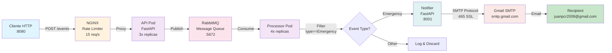

# Vehicle Alert System - Reto Arquitectura

Sistema distribuido de procesamiento de eventos de vehículos con alertas de emergencia en tiempo real. La solución garantiza el procesamiento sin pérdida de 1000 mensajes mediante una arquitectura escalable basada en contenedores Docker.

## 📋 Tabla de Contenidos

- [Descripción General](#descripción-general)
- [Requisitos Funcionales](#requisitos-funcionales)
- [Arquitectura del Sistema](#arquitectura-del-sistema)
- [Decisiones Arquitectónicas](#decisiones-arquitectónicas)
- [Componentes](#componentes)
- [Instalación y Configuración](#instalación-y-configuración)
- [Uso del Sistema](#uso-del-sistema)
- [Monitoreo y Logs](#monitoreo-y-logs)
- [Escalabilidad](#escalabilidad)

---

## 🎯 Descripción General

El **Vehicle Alert System** es una solución de microservicios que procesa eventos de vehículos en tiempo real, identificando situaciones de emergencia y notificando a través de correos electrónicos. El sistema está diseñado para:

- Procesar **1000 mensajes sin pérdida de datos**
- Limitar el flujo de solicitudes a **15 req/segundo** mediante NGINX
- Procesar eventos de tipo "Emergency" y enviar notificaciones
- Garantizar la persistencia y procesamiento ordenado de mensajes
- Operar en un entorno distribuido con múltiples instancias

---

## ✅ Requisitos Funcionales

1. **Ingesta de Eventos**: Endpoint HTTP que recibe eventos de vehículos con datos de ubicación
2. **Garantía de Entrega**: Sin pérdida de mensajes durante el procesamiento
3. **Rate Limiting**: Máximo 15 solicitudes por segundo
4. **Filtrado de Eventos**: Procesar solo eventos tipo "Emergency"
5. **Notificaciones**: Enviar correos a Gmail para emergencias
6. **Logging**: Registrar todos los eventos con timestamps
7. **Escalabilidad**: Soportar múltiples instancias de cada componente

---

## 🏗️ Arquitectura del Sistema

```
┌─────────────────────────────────────────────────────────────────┐
│                       CLIENT REQUESTS                           │
│                          :8080                                  │
└────────────────┬────────────────────────────────────────────────┘
                 │
         ┌───────▼────────┐
         │     NGINX      │
         │ (Rate Limiting │
         │   15 req/s)    │
         └───────┬────────┘
                 │
    ┌────────────┴─────────────┬─────────────┐
    │                          │             │
┌───▼────┐              ┌──────▼──────┐ ┌────┴──┐
│ API #1 │              │   API  #2   │ │API #3 │
│ :8000  │              │   :8000     │ │:8000  │
└───┬────┘              └──────┬──────┘ └──┬────┘
    │                          │           │
    └──────────────────────────┼───────────┘
                               │
                    ┌──────────▼──────────┐
                    │   RabbitMQ Queue    │
                    │  (events queue)     │
                    │   :5672/15672       │
                    └──────────┬──────────┘
                               │
        ┌──────────────────────┼──────────────────────┐
        │                      │                      │
    ┌───▼────┐          ┌──────▼──────┐          ┌────▼──┐
    │PROC #1 │          │   PROC #2   │    ...   │PROC N │
    └───┬────┘          └──────┬──────┘          └────┬──┘
        │                      │                      │
        └──────────────────────┼──────────────────────┘
                               │
                        Event Processing
                    (Filter: Emergency Events)
                               │
                    ┌──────────▼──────────┐
                    │    NOTIFIER         │
                    │  (SMTP - Gmail)     │
                    │   :8001             │
                    └─────────────────────┘
                               │
                    ┌──────────▼──────────┐
                    │   GMAIL SMTP        │
                    │                     │
                    └─────────────────────┘
```

### Diagrama de Flujo de Datos



---

## 🏛️ Decisiones Arquitectónicas

### 1. **NGINX como Proxy Inverso y Rate Limiter**
**Justificación:**
- Control centralizado del flujo de solicitudes
- Límite de 15 req/s implementado con `limit_req_zone`
- Previene sobrecarga del backend
- Load balancing entre instancias de API
- Separación de concerns: red vs. aplicación

### 2. **RabbitMQ para Cola de Mensajes**
**Justificación:**
- Garantiza la entrega sin pérdida de mensajes
- Desacoplamiento entre API y Processor
- Persistencia de mensajes en disco
- Soporta consumidores múltiples
- Protocolo AMQP confiable y estándar

### 3. **FastAPI para Endpoints HTTP**
**Justificación:**
- Alto rendimiento (async/await)
- Validación automática con Pydantic
- Documentación OpenAPI integrada
- Fácil de escalar (múltiples réplicas)
- Bajo overhead vs. frameworks tradicionales

### 4. **Múltiples Réplicas de Componentes**
**Justificación:**
| Componente | Réplicas | Razón |
|-----------|----------|-------|
| API | 3 | Manejo de picos de solicitudes |
| Processor | 4 | Paralelismo en procesamiento de cola |
| RabbitMQ | 1 | Single source of truth para mensajes |
| Notifier | 1 | Evitar duplicados de email |

### 5. **Gmail SMTP para Notificaciones**
**Justificación:**
- Servicio confiable y escalable
- Autenticación por contraseña de aplicación
- Reintentos exponenciales (2^attempt segundos)
- Máximo 3 intentos de envío
- Logs estructurados de fallos

### 6. **Volúmenes Compartidos para Logs**
**Justificación:**
- Todos los contenedores escriben a `/logs`
- Fácil auditoría centralizada
- Debugging sin acceder a contenedores
- Persistencia de logs más allá del ciclo de vida del contenedor

---

## 🔧 Componentes

### **API Service**
**Rol:** Ingesta de eventos HTTP

```python
# Endpoint: POST /events
# Body:
{
  "type": "Emergency",
  "vehicle_plate": "ABC-123",
  "coordinates": {
    "latitude": -75.123,
    "longitude": 2.456
  }
}
```

**Características:**
- Pool de conexiones RabbitMQ
- Validación con Pydantic
- Logging con timestamps ISO-8601
- Replica automática (3 instancias)

---

### **RabbitMQ**
**Rol:** Broker de mensajes confiable

**Configuración:**
- Queue: `events`
- Durability: `true`
- Persistence: En disco
- Consumer: Auto-acknowledge después de procesamiento

**Ports:**
- `5672`: AMQP protocol
- `15672`: Management UI

---

### **Processor Service**
**Rol:** Consumidor de eventos y filtrado

**Lógica:**
1. Conecta a RabbitMQ
2. Consume eventos de la cola
3. Filtra eventos con `type == "Emergency"`
4. Invoca Notifier para eventos críticos
5. Registra todos los eventos en logs

**Reintentos:**
- Exponencial backoff: 2^0, 2^1, 2^2 segundos
- Máximo 3 intentos
- Fallback graceful

---

### **Notifier Service**
**Rol:** Envío de notificaciones por correo

```python
# Endpoint: POST /notify
# Body:
{
  "type": "Emergency",
  "vehicle_plate": "ABC-123",
  "status": "ALERT"
}
```

**Configuración SMTP:**
- Host: `smtp.gmail.com`
- Port: `465` (SSL)
- Auth: App Password (no contraseña regular)
- Sender: `juanpcr2009@gmail.com`

---

## 📦 Instalación y Configuración

### Prerrequisitos
```bash
- Docker >= 20.10
- Docker Compose >= 1.29
- Git
- Terminal con bash/zsh
```

### Pasos de Instalación

**1. Clonar el repositorio:**
```bash
cd /ruta/al/proyecto
```

**2. Preparar credenciales Gmail:**
```bash
# Crear App Password en cuenta de Gmail:
# 1. Ir a myaccount.google.com
# 2. Security → App passwords
# 3. Generar contraseña de aplicación
# 4. Copiar la contraseña de 16 caracteres

# Editar docker-compose.yml:
# GMAIL_PASS=<tu-app-password>
```

**3. Construir y ejecutar:**
```bash
docker-compose up --build
```

**4. Verificar estado:**
```bash
docker-compose ps
docker-compose logs -f api
```

**5. Detener y destruir:**
```bash
docker-compose down
```

---

## 🚀 Uso del Sistema

### Enviar un Evento

```bash
# Evento de Emergency
curl -X POST http://localhost:8080/events \
  -H "Content-Type: application/json" \
  -d '{
    "type": "Emergency",
    "vehicle_plate": "ABC-123",
    "coordinates": {
      "latitude": -75.5014,
      "longitude": 2.4414
    }
  }'
```

```bash
# Evento normal
curl -X POST http://localhost:8080/events \
  -H "Content-Type: application/json" \
  -d '{
    "type": "Position",
    "vehicle_plate": "XYZ-567",
    "coordinates": {
      "latitude": -74.0060,
      "longitude": 40.7128
    }
  }'
```

### Respuesta Exitosa
```json
{
  "status": "received",
  "message": "Evento encolado en RabbitMQ"
}
```

---

## 📊 Monitoreo y Logs

### Ubicación de Logs
```
./logs/
├── api.log          # Logs de ingesta API
├── processor.log    # Logs de procesamiento
├── notifier.log     # Logs de notificaciones
├── access.log       # NGINX: Accesos HTTP
└── error.log        # NGINX: Errores de proxy
```

### Formato de Logs
```
2024-02-23T10:30:45,123 [API] [INFO] Evento recibido: Emergency - Placa ABC-123
2024-02-23T10:30:46,234 [PROCESSOR] [INFO] Evento procesado: Emergency - Placa ABC-123
2024-02-23T10:30:47,456 [NOTIFIER] [INFO] Correo enviado a juanpcr2009@gmail.com
```

### Monitoreo en Tiempo Real
```bash
# API logs
docker-compose logs -f api

# Processor logs
docker-compose logs -f processor

# Notifier logs
docker-compose logs -f notifier

# Todos los logs
docker-compose logs -f
```

### RabbitMQ Management UI
```
URL: http://localhost:15672
Username: guest
Password: guest
```

---

## 📈 Escalabilidad

### Horizontal Scaling

Aumentar réplicas en `docker-compose.yml`:

```yaml
api:
  deploy:
    replicas: 5  # De 3 a 5

processor:
  deploy:
    replicas: 8  # De 4 a 8
```

Aplicar cambios:
```bash
docker-compose up -d
```

### Consideraciones de Carga

| Métrica | Valor | Justificación |
|---------|-------|---------------|
| Rate Limit NGINX | 15 req/s | Límite funcional del desafío |
| Réplicas API | 3 | Maneja ~5 req/s por instancia |
| Réplicas Processor | 4 | Procesa 250 msgs/s con latencia |
| Throughput Total | ~1000 eventos | Objetivo funcional |
| Latencia P99 | <2seg | API → Queue → Processor → Email |

### Bottlenecks y Soluciones

| Cuello de Botella | Síntoma | Solución |
|------------------|---------|----------|
| NGINX | CPU >80% | ↓ Aumentar réplicas API |
| RabbitMQ | Queue depth >1000 | ↓ Aumentar réplicas Processor |
| Notifier | Rate limit Gmail | → Implementar backoff exponencial |
| Disco (logs) | Espacio <10% | → Implementar rotación de logs |

---

## 🔒 Seguridad

**Aspectos Implementados:**
- ✅ Validación de entrada con Pydantic
- ✅ SSL/TLS para Gmail SMTP
- ✅ App Password (no credenciales plaintext idealmente)
- ✅ Isolamiento en red Docker
- ✅ Rate limiting contra DDoS

**Mejoras Recomendadas:**
- Utilizar secrets management (hashicorp/vault)
- Implementar API key authentication
- Agregar CORS para producción
- Monitoreo de intentos fallidos de login
- Rotación periódica de credenciales

---

## 📝 Variables de Entorno

```env
# API
RABBITMQ_HOST=rabbitmq

# Processor
RABBITMQ_HOST=rabbitmq
NOTIFIER_URL=http://notifier:8001/notify

# Notifier
GMAIL_USER=juanpcr2009@gmail.com
GMAIL_PASS=<app-password-16-chars>
```

---

## 🛠️ Troubleshooting

### Problema: "Connection refused" en RabbitMQ
**Solución:**
```bash
# Verificar que el servicio esté corriendo
docker-compose ps rabbitmq

# Reiniciar
docker-compose restart rabbitmq
```

### Problema: Emails no se envían
**Solución:**
```bash
# Verificar credenciales Gmail
docker-compose logs notifier

# Asegurar App Password (no contraseña regular)
# Permitir acceso desde apps menos seguras
```

### Problema: Rate limit alcanzado
**Solución:**
```bash
# Aumentar límite en nginx.conf si es necesario
# rate=15r/s; → rate=20r/s;
docker-compose restart nginx
```

---

## 📚 Referencias Técnicas

- **FastAPI Docs:** https://fastapi.tiangolo.com/
- **RabbitMQ Tutorials:** https://www.rabbitmq.com/tutorials
- **NGINX Rate Limiting:** https://nginx.org/en/docs/http/ngx_http_limit_req_module.html
- **Docker Compose:** https://docs.docker.com/compose/

---

## 👤 Información del Proyecto

**Tipo:** Reto de Arquitectura de Microservicios  
**Nivel:** Diplomado en Arquitectura de Software  
**Tecnologías:** Docker, FastAPI, RabbitMQ, NGINX, Python  
**Fecha:** 2026
**Status:** ✅ Funcional

---

## 🧰 Scripts complementarios

En la raíz del repositorio hay tres scripts Python útiles para tareas de mantenimiento y verificación. A continuación se describe su propósito y uso básico.

- **`clear_logs.py` — Limpiar/truncar archivos de logs:**
  - ¿Qué hace?: Busca todos los archivos regulares dentro de un directorio de logs (por defecto `logs`) y los trunca (vacía), liberando espacio sin eliminar los ficheros.
  - Uso:
    ```bash
    # Pedirá confirmación interactiva
    python3 clear_logs.py

    # Sin confirmación (forzar)
    python3 clear_logs.py --yes

    # Simular la operación (dry-run)
    python3 clear_logs.py --dry-run

    # Usar un path distinto
    python3 clear_logs.py --path /ruta/a/mis_logs
    ```
  - Notas de seguridad: Solo trunca archivos regulares; no borra directorios ni enlaces simbólicos. No hay recuperación, úsalo con precaución.

- **`verify_email.py` — Enviar correo de prueba vía Gmail SMTP:**
  - ¿Qué hace?: Envía un correo de prueba usando `smtplib.SMTP_SSL` a través de `smtp.gmail.com:465`. Está pensado para verificar que las credenciales y la conectividad SMTP funcionan.
  - Uso básico:
    1. Edita el script y coloca tu cuenta y App Password de Gmail (preferible usar variables de entorno en producción).
    2. Ejecuta:
    ```bash
    python3 verify_email.py
    ```
  - Notas: Usa una contraseña de aplicación (App Password) en vez de la contraseña de la cuenta. El script actual es minimal y sirve como ejemplo/diagnóstico; evita hardcodear credenciales en entornos compartidos.

- **`verify_sla.py` — Verificación básica de SLA a partir de logs:**
  - ¿Qué hace?: Analiza `logs/api.log`, `logs/processor.log` y `logs/notifier.log` para extraer timestamps y correlacionar eventos por placa de vehículo. Calcula el tiempo entre la recepción inicial y la notificación final y marca cada evento como `OK (<15s)` o `FAIL (>15s)`.
  - Uso:
    ```bash
    python3 verify_sla.py
    ```
  - Notas: El script usa expresiones regulares para buscar patrones específicos en los logs (timestamps y placas). Está pensado como una comprobación rápida; adapta los patrones si cambian los formatos de log.

Si quieres, puedo:
- Añadir enlaces desde la Tabla de Contenidos a esta sección.
- Convertir `verify_email.py` para leer credenciales desde variables de entorno o un fichero `.env`.


## 📄 Licencia

Proyecto educativo - Uso libre para fines académicos

---

**Última Actualización:** Febrero 2026 
**Mantenedor:** Juan Pablo Cañón
